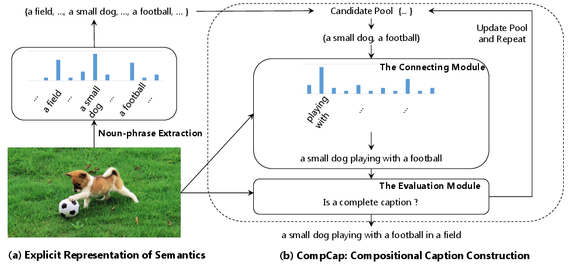
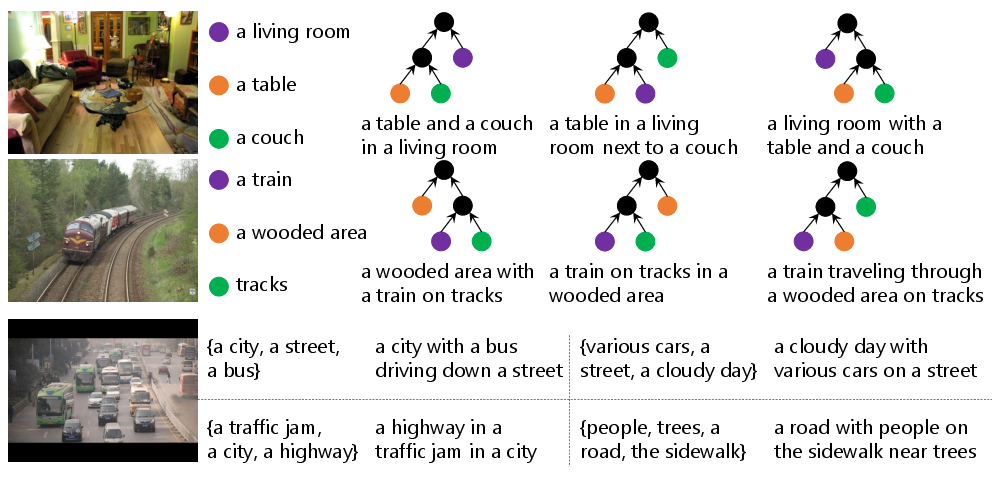

# Code of [A Neural Compositional Paradigm for Image Captioning](http://papers.nips.cc/paper/7346-a-neural-compositional-paradigm-for-image-captioning)

Borrowed some code from [AdaptiveAttention](https://github.com/jiasenlu/AdaptiveAttention).

## Overview



## Summarization

- We propose a compositional captioning model, where caption generation follows a recursive structure, 
which naturally fits the properties of human language. 
Specifically,
we could generate diverse captions based on the same visual semantics by changing syntax,
or attentions. 



## Codes

- *nlp*: scripts for processing sentences using a nlp toolkit

- *data*: scripts for processing data

- *misc*: models, dataloaders, and auxiliary codes

- *image_models*: pretrained image models

- *test*: scripts for studies

- *scripts*: bashs

## Citation

```
@inproceedings{dai2018aneural,
title = {A Neural Compositional Paradigm for Image Captioning},
author = {Dai, Bo and Fidler, Sanja and Lin, Dahua},
booktitle = {Advances in Neural Information Processing Systems 31},
pages = {658--668},
year = {2018}
}
```
